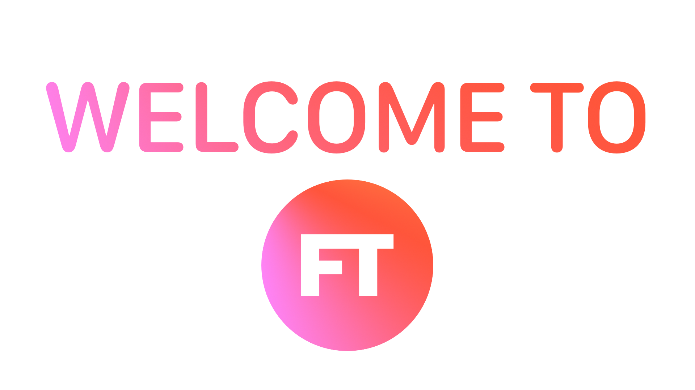

==========

<p align="center">


<a href="/LICENSE">

</a>
</p>


## Table of Contents

- [Features](#features)
- [Screenshots](#screenshots)
- [Device Compatibility](#device-compatibility)
- [Installation](#installation)
- [Credits](#credits)
- [Copyright](#copyright)
- [Privacy Policy](privacy_policy.md)

## Features

- [x] iMessage sticker pack
- [x] Super clean UI
- [x] iOS's native video playback interface
- [x] Dark mode
- [x] Onboarding screen
- [x] Augmented reality stickers

## Screenshots

Screenshots will be added soon


## Installation

Clone the project in XCode 11. You will be able to build and run to devices running iOS 13. 
The you will need to install Cocoapods if you don't have it already. When you have Cocoapods installed, open a terminal at the project folder and run this command in terminal:
```ruby
pod install
```


## Device Compatibility

Foodie Thing is compatible with devices running iOS 13. This includes iPhones and iPads. There is no Catalyst support. 
The app works as intended on all devices running iOS 13 except the iPad Air 2.


## Dark Mode

Dark mode is supported on devices running iOS 13. Toggling the iOS system dark mode will also toggle the app's dark mode.


## Credits

Foodie Thing is run by Jonah Sachs, this project was written by Tadreik Campbell.

## Copyright

    Copyright © 2019-2020 Tadreik Campbell. All rights reserved.

    The Foodie Thing app is free software: you can redistribute it and/or modify
    it under the terms of the GNU General Public License as published by
    the Free Software Foundation, either version 3 of the License, or
    (at your option) any later version.

    The Foodie Thing app is distributed in the hope that it will be useful,
    but WITHOUT ANY WARRANTY; without even the implied warranty of
    MERCHANTABILITY or FITNESS FOR A PARTICULAR PURPOSE.  See the
    GNU General Public License for more details.

    You should have received a copy of the GNU General Public License
    along with the Foodie Thing app.  If not, see <http://www.gnu.org/licenses/>.


